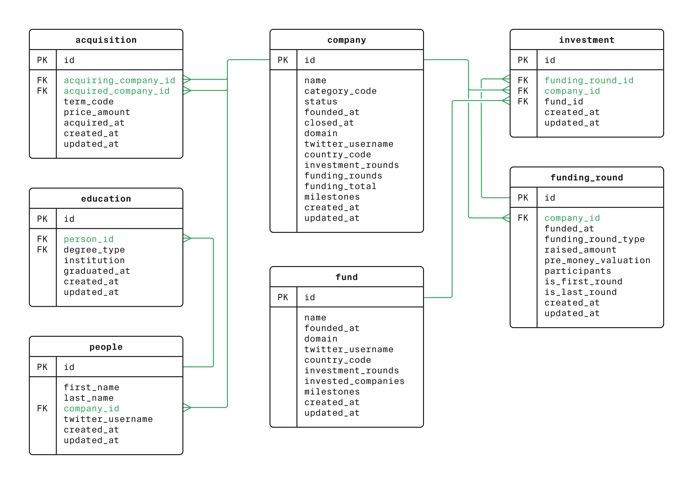

# Startup Trends SQL Case Study

## 📌 Project Overview
This project explores startup funding, acquisitions, and employee data through SQL queries.  
It was completed as part of the **TripleTen Business Intelligence Program** and simulates working as a junior analyst at *VentureInsight*, a research firm serving venture capital clients.

The goal was to answer 10 business questions using PostgreSQL, focusing on company performance, funding patterns, acquisitions, and employee backgrounds.  

---

## 🗂 Dataset & Schema
The case study is based on a Crunchbase-style database that includes:

- **company** – startup details (funding, status, country, category)  
- **funding_round** – round metadata (amount, round type, dates)
- **investment** — link table: a **fund**’s participation in a **funding_round** (with company_id)    
- **fund** – venture fund profile (invested_companies, investment_rounds, etc.)  
- **acquisition** – acquisition deals (price, terms, dates) 
- **people** – individuals (founders/employees) tied to a company 
- **education** – educational background of individuals  

---

## 🔍 Analysis Tasks
The case study consisted of 10 questions, each requiring SQL queries with aggregations, joins, and subqueries.  

1. **Startup Landscape:** Count how many companies have closed.  
2. **Sector Analysis (US News):** Funding totals for news-related companies in the USA.  
3. **Cash Acquisitions (2011–2013):** Total value of acquisitions paid in cash.  
4. **Influencer Discovery (Twitter “Silver”):** People with Twitter handles starting with "Silver".  
5. **Finance Influencers (Twitter “money” + last name “K”):** More targeted influencer search.  
6. **Geographic Funding:** Total capital raised by country.  
7. **Funding Round Volatility:** Identify days with large variation between smallest and largest funding rounds.  
8. **Fund Activity Classification:** Categorize venture funds into *high*, *middle*, and *low activity*.  
9. **Investment Strategy by Activity:** Compare average number of funding rounds per activity category.  
10. **Employee Education vs. Startup Success:** Compare average degrees per employee at failed vs. successful startups.  

See the full SQL solutions in [`queries.sql`](queries.sql).

---

## 💡 Key Insights
- **Failure appears rare in this dataset:** Only **2,584 companies (≈1.3%)** were marked as closed, while ~194K were still operating or acquired. This contrasts with real-world startup failure rates and suggests the dataset may underreport closures.  
- **US news startups show extreme variation in funding:** The top firms raised **$622M, $250M, and $160M**, while the majority raised under $10M — highlighting a sharp skew in capital distribution.  
- **Cash acquisitions totaled $137.8B** between 2011–2013, showing the scale of post-recession dealmaking.  
- **Influencer queries can pinpoint niche groups:** Searches surfaced people with “Silver” in their Twitter handle and finance-related influencers like Gregory Kim (`gmoney75`).  
- **Geographic analysis underscores US dominance:** The **USA ($310B)** raised far more than the next countries — the UK (~$17.7B), China (~$10.7B), and Canada (~$9.9B).  
- **Funding round volatility days stood out** where both small ($28K–$40K) and massive ($200M–$448M) rounds occurred, suggesting unusual investor activity on those dates.  
- **Fund activity categories reveal strong contrasts:** Most funds are *low activity*, while top-tier firms like **Greylock Partners** fall into *high activity* with 196+ invested companies.  
- **Fund strategies diverge sharply:** *High activity funds* averaged **252 rounds**, compared to **51** for mid-tier funds and just **2** for low-activity funds.  
- **Employee education vs. success:** Employees at failed one-round startups averaged **1.23 degrees per person**. This provides a data point for the debate, though the small failure sample size limits definitive conclusions.

---

## 🛠 Tools & Techniques
- **PostgreSQL** for querying  
- Subqueries, `JOIN`s, `CASE` statements, aggregation functions  
- Data cleaning through query logic (handling NULLs, filtering booleans vs. integers)  

---

