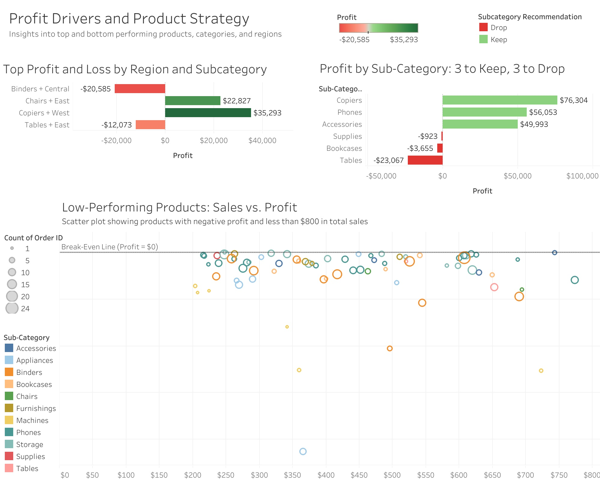

# 🛒 Saving Superstore: Operational & Profitability Analysis | Tableau

## Overview
The Superstore is at risk of bankruptcy. As a business intelligence consultant, I conducted a multi-part analysis to identify profit drivers and loss-makers, assess the value of advertising, and evaluate operational risk based on product returns. This project is structured across three dashboards—each addressing a core challenge.

## Objectives
1. Identify top profit centers and loss-makers across products and regions  
2. Recommend which sub-categories to keep or stop selling  
3. Develop a high-ROI advertising strategy across states and months  
4. Detect product return patterns and high-risk customers to reduce losses  

## Tools & Techniques
- **Tableau**: Dashboard creation, parameter switches, calculated fields
- **Excel**: Data cleanup, calculated fields, and LEFT JOIN to merge `Returns` with `Orders` on `Order ID`

### Parameters Used:
- `Measures1`: Swaps between Avg Discount, Total Profits, Sales, Number of Sales, and Avg Profit
- `Date Trunc (Order Date)`: Allows toggling between year, quarter, or month views

### Key Calculated Fields:
- `Returned Calculation`:  
  `IF [Returned] = "Yes" THEN 1 ELSE 0 END`
- `Suggested Ad Budget`:  
  `AVG([Profit]) * COUNT([Order ID]) * 0.2`
- `Subcategory Recommendations`:  
  Classifies sub-categories as “Keep”, “Drop”, or “Neutral”
- `Top and Bottom Picks`:  
  Flags key performers for visual highlighting

---

## 📊 Dashboards

🔗 [View the Full Dashboard Suite](https://public.tableau.com/app/profile/dalya.s/viz/SuperStoreAnalysis_17497643785760/ReturnsandRiskAnalysis)

### 1. 💰 Profit Drivers & Product Strategy
- Identify top- and bottom-performing combinations of Region + Sub-Category
- Recommend which sub-categories to keep or drop
- Highlight low-performing individual products

### 2. 📈 Advertising Strategy
- Analyze profit trends by **state** and **month**
- Identify the top 3 state-month pairs for ad investment
- Suggest budgets based on average profit (1/5 rule)

### 3. 📦 Returns & Risk Analysis
- Spot high-return products and customers
- Visualize return rate vs. profit by state
- Identify operational risks undermining profitability

---

## 🔍 Key Insights

### 💰 Profits & Losses
- **Top Profit Sub-Categories**: Copiers, Phones, Accessories  
- **High-Loss Areas**: Tables, Bookcases, Supplies  
- **Recommendation**: Cut underperformers and reallocate investment

### 📈 Advertising ROI
- **Top Ad Opportunities**:  
  - Washington (March)  
  - California (August)  
  - New York (October)  
- **Budget Logic**: Set ad spend to 20% of monthly profit in each state

### 📦 Returns & Risk
- **Risky Products**: Avery 500, Logitech BoomBox, Newell 308, Xerox 1955  
- **High Return Customers**: Flagged for operational review  
- **Geographic Risk**: States like Colorado and Ohio have high return rates + low profit

---

## 📂 Project Files

- 📊 [Tableau Dashboard (3-part suite)](https://public.tableau.com/app/profile/dalya.s/viz/SuperStoreAnalysis_17497643785760/ReturnsandRiskAnalysis)
- 📄 `superstore_cleaned.csv` — Final dataset (Orders + Returns joined)
- 🖼️ `/screenshots/` — Dashboard screenshots:
  - 
  - 
  - `Returns and Risk Analysis.jpg`
- 🧾 `README.md` — This summary file

---

## 👩‍💻 Connect With Me
- 📄 [Resume](https://docs.google.com/document/d/1__BjBZNdEdzZwglkZYnPurL69lSgW1B4-WJvTYCPRB4/edit?usp=sharing)
- 💼 [LinkedIn](https://www.linkedin.com/in/dalyasohl)
- 📊 [Tableau Portfolio](https://public.tableau.com/app/profile/dalya.s/vizzes)
- 📚 [Kaggle Profile](https://www.kaggle.com/dalyas)
