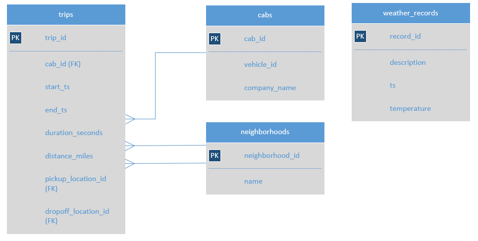

# 🚖 Zuber SQL Case Study

## 📌 Project Overview
This case study explores taxi ride data in Chicago for a fictional ride-sharing company, **Zuber**.  
The goal was to uncover usage patterns across cab companies and evaluate how **weather conditions** affect ride duration — specifically rides between the Loop and O'Hare Airport.  

The project was completed as part of the **TripleTen Business Intelligence Program** to practice SQL querying, multi-table joins, and business analysis.

---

## 🧠 Business Questions

### Part 1: Exploratory Ride Analysis
1. How many rides did each taxi company complete on **Nov 15–16, 2017**?  
2. How many rides were completed by companies containing **“Yellow” or “Blue”** from **Nov 1–7, 2017**?  
3. In November 2017, how did **Flash Cab** and **Taxi Affiliation Services** compare to all other companies combined?  

### Part 2: Weather & Ride Duration Analysis
1. How does ride duration from **Loop to O'Hare** differ on **rainy Saturdays** vs. other days?  
2. How do we classify “Bad” vs. “Good” weather conditions?  
3. Can we detect a measurable impact of weather on ride time?  

---

## 🗂 Dataset & Schema
The dataset consists of four relational tables:  

- **trips** — ride details (timestamps, distance, duration, pickup & dropoff IDs)  
- **cabs** — cab company and vehicle info  
- **neighborhoods** — neighborhood IDs mapped to names (e.g., Loop, O’Hare)  
- **weather_records** — timestamped weather descriptions and temperatures  

---

## 🧾 SQL Query Files

| Filename | Description |
|----------|-------------|
| `01_exploratory_company_rides.sql` | Company ride counts for different November timeframes |
| `02_weather_conditions_flag.sql`  | Creates a weather condition label (`Good` vs `Bad`) using `CASE` |
| `03_loop_to_ohare_rainy_saturdays.sql` | Analyzes Loop→O'Hare ride durations by weather and weekend filters |

All queries are written in **PostgreSQL-compatible SQL** and include comments explaining the logic.

---

## 💡 Key Insights
- **Nov 15–16 leader:** *Flash Cab* completed **19,558** rides, followed by *Taxi Affiliation Services* (**11,422**) and *Medallion Leasin* (**10,367**); *Yellow Cab* had **9,888**.
- **“Yellow/Blue” companies (Nov 1–7):** Combined, these brands completed **87,320** rides — led by **Yellow Cab (33,668)** and **Taxi Affiliation Service Yellow (29,213)**; *Blue Ribbon Taxi Association Inc.* had **17,675**, *Blue Diamond* **6,764**.
- **November market split:** Out of **437,438** total rides, **Other** companies handled **335,771** (**~76.8%**), *Flash Cab* **64,084** (**~14.7%**), and *Taxi Affiliation Services* **37,583** (**~8.6%**).
- **Neighborhood IDs confirmed:** **Loop = 50**, **O’Hare = 63** (ensures reproducible filtering in trip queries).
- **Weather labeling:** Most hourly records in November were tagged **Good** (clear), with **Bad** (rain/storm) appearing intermittently — enabling weather-based comparisons.
- **Loop → O’Hare on Saturdays:** Sample results show some of the **longest durations under Bad weather** (~2,969–3,120 sec ≈ 49–52 min), while **Good** conditions vary widely (e.g., 1,260–4,800 sec). Suggests weather can increase travel time; aggregating by weather group would quantify the effect.

---

## 🛠 Tools & Techniques
- **PostgreSQL** for querying  
- Joins across multiple tables (`JOIN`)  
- Conditional logic with `CASE`  
- Date/time extraction 
- Aggregations and filtering
- CTE  

---
